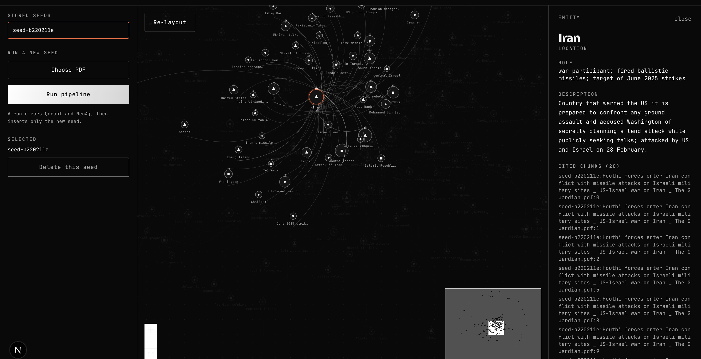
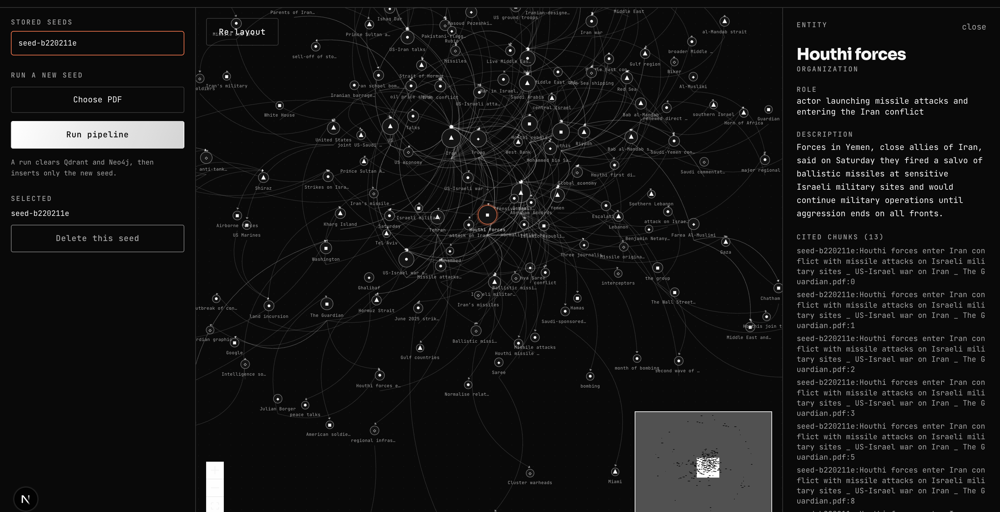

```
████    ███   █   █  █████  █   █  █████   ███   █   █
█   █  █   █  ██  █    █    █   █  █      █   █  ██  █
████   █████  █ █ █    █    █████  ████   █   █  █ █ █
█      █   █  █  ██    █    █   █  █      █   █  █  ██
█      █   █  █   █    █    █   █  █      █   █  █   █
█      █   █  █   █    █    █   █  █████   ███   █   █
```

> Give it one sentence. It builds a graph, wakes up the people in it, and
> lets them argue about it without you.

Curious what's actually going on under the hood? We're not explaining it
twice. 👉 **visit: [aisimulation.site](https://aisimulation.site)**

---

## What this is

*Project still being built*

A knowledge-base engine. Feed it a seed PDF (a real event or a made-up one).
It extracts the text, optionally pulls live real-world articles, chunks and
stores that context in Qdrant, extracts the entities and relationships into a
per-seed Neo4j graph, and bridges the two stores by id. Graph RAG retrieval on
top of that knowledge base is the next milestone. The `frontend/` folder is the
marketing site; the actual engine lives under `services/`.

**Status: the knowledge-base pipeline is implemented.** Upload a seed PDF and
it extracts text, optionally pulls live articles, stores chunked context in
Qdrant, extracts entities and relationships into a per-seed Neo4j graph, and
bridges the two by id. Graph RAG retrieval on top is the next milestone.

## Screenshots

The console: one seed's knowledge graph drawn as a balloon, with every node draggable and all edges bowed outward.



Clicking any entity or relationship opens its description and the exact chunks it is grounded in.



## Project layout

```
AI-Engine/
  app/               shared settings (reads .env)
  services/
    Orchestration/    the pipeline: intake -> fetch -> store -> extract -> graph
    Rag/              Qdrant ingestion + embeddings + retrieval primitives
    MCP/              Tavily web-search MCP server + client
  frontend/           Next.js marketing site ("Pantheon")
  frontend_app/       Next.js console: run a seed + interactive graph
  docs/               living project docs
```

## Setting up the backend

Requires Python 3.12 and [uv](https://docs.astral.sh/uv/).

```bash
# install dependencies
uv sync

# copy the environment template and fill in your own keys
cp .env.example .env   # if one doesn't exist yet, create .env directly
```

You'll need values for at least:

```
OPENROUTER_API_KEY / OPENROUTER_BASE_URL
GROQ_API_KEY
TAVILY_API_KEY
QDRANT_API_KEY / QDRANT_CLUSTER_ENDPOINT
GEMINI_API_KEY
NEO4J_URI / NEO4J_USERNAME / NEO4J_PASSWORD
EMBEDDING_PROVIDER   (gemini, or custom — see CUSTOM_EMBEDDING_* if so)
```

Run the knowledge-base pipeline API (PDF upload):

```bash
uv run uvicorn services.Orchestration.main:app --reload
# then POST a PDF to http://localhost:8000/seed
```

Run the RAG service (health endpoint only for now; retrieval is not exposed
over HTTP until Graph RAG is built):

```bash
uv run uvicorn services.Rag.main:app --reload
```

## Setting up the frontend

Requires Node 20+.

```bash
cd frontend
npm install
npm run dev
```

Then open `http://localhost:3000`.

```bash
npm run build   # production build
npm run lint    # eslint
```

## Testing the pipeline with the console

`frontend_app/` is a Next.js app for driving the API: pick a stored seed to view
its graph without re-running, or upload a PDF to run the pipeline, then explore
the extracted nodes and edges and delete the seed when done. It is not the
marketing site.

```bash
cd frontend_app
npm install
npm run dev          # http://localhost:3000 (or the next free port)
```

Run the API alongside it (`uvicorn ... --port 8000`); CORS is allowed for any
local port. Viewing a stored seed is read-only; a run wipes Qdrant and Neo4j and
inserts only the new seed. `DELETE /seed/{seed_id}` removes that seed's data from
both stores. Note the API has no auth on that route, so keep it local.

## Docs

`docs/KNOWLEDGE_GRAPH.md` and `docs/plan.md` track the architecture and
build history in more detail than this file ever will.
