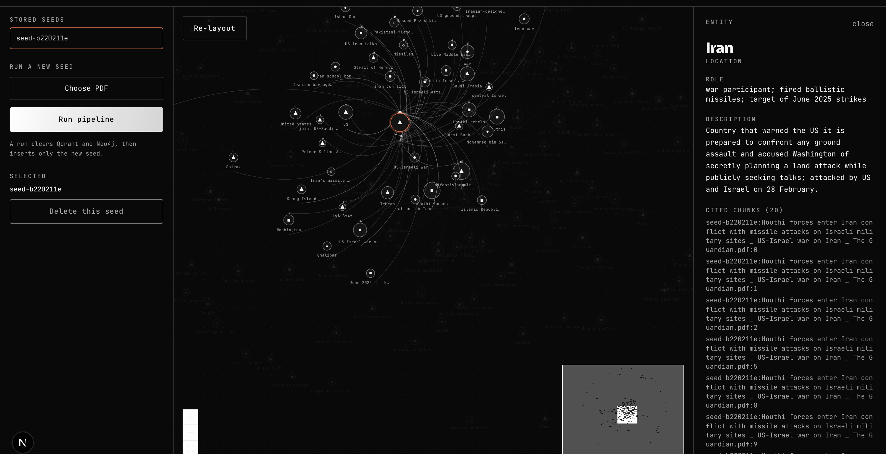
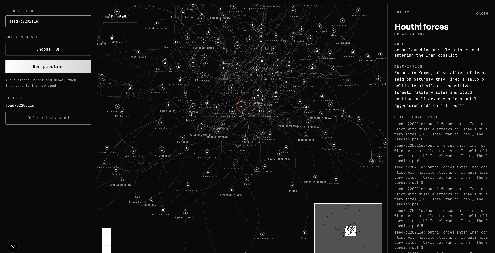

```
████    ███   █   █  █████  █   █  █████   ███   █   █
█   █  █   █  ██  █    █    █   █  █      █   █  ██  █
████   █████  █ █ █    █    █████  ████   █   █  █ █ █
█      █   █  █  ██    █    █   █  █      █   █  █  ██
█      █   █  █   █    █    █   █  █      █   █  █   █
█      █   █  █   █    █    █   █  █████   ███   █   █
```

> Give it one sentence. It builds a graph, wakes up the people in it, and
> lets them argue about it without you.

Curious what's actually going on under the hood? We're not explaining it
twice. 👉 **visit: [aisimulation.site](https://aisimulation.site)**

---

## What this is

A knowledge-base engine. Feed it a seed PDF (a real event or a made-up one).
It extracts the text, optionally pulls live real-world articles, chunks and
stores that context in Qdrant, extracts the entities and relationships into a
per-seed Neo4j graph, and bridges the two stores by id. Graph RAG retrieval on
top of that knowledge base is the next milestone. The `frontend/` folder is the
marketing site; the actual engine lives under `services/`.

**Status: the knowledge-base pipeline is implemented.** Upload a seed PDF and
it extracts text, optionally pulls live articles, stores chunked context in
Qdrant, extracts entities and relationships into a per-seed Neo4j graph, and
bridges the two by id. On top of the finished graph, entities can be promoted
into agents (one of four behavioural archetypes) and chatted with, grounded in
the stored chunks. Graph RAG retrieval over the knowledge base is the next
milestone.

## Screenshots

The console: one seed's knowledge graph drawn as a balloon, with every node draggable and all edges bowed outward.



Clicking any entity or relationship opens its description and the exact chunks it is grounded in.



## Project layout

```
AI-Engine/
  app/               shared settings (reads .env)
  services/
    Orchestration/    the pipeline: intake -> fetch -> store -> extract -> graph
                      plus the agent pool / grounded agent chat, and the HTTP API
    Rag/              Qdrant ingestion, loaders, embeddings, retrieval primitives
                      (Graph RAG retrieval is the next milestone)
    MCP/              MCP servers + client: Tavily web search, social context
                      (X / Instagram / Facebook) under MCP/social/
  frontend/           Next.js marketing site ("Pantheon")
  frontend_app/       Next.js console: run a seed + interactive graph + agent chat
  DATA/               uploaded seeds, fetched articles, social posts, plaintext
                      (gitignored, created at runtime)
```

Documentation is kept local (gitignored) under `docs/`; see the note at the
bottom of this file.

## Setting up the backend

Requires Python 3.12 and [uv](https://docs.astral.sh/uv/).

```bash
# install dependencies
uv sync

# copy the environment template and fill in your own keys
cp .env.example .env
```

You'll need values for at least:

```
OPENROUTER_API_KEY / OPENROUTER_BASE_URL
GROQ_API_KEY
TAVILY_API_KEY
QDRANT_API_KEY / QDRANT_CLUSTER_ENDPOINT
GEMINI_API_KEY
NEO4J_URI / NEO4J_USERNAME / NEO4J_PASSWORD
EMBEDDING_PROVIDER   (gemini, or custom — see CUSTOM_EMBEDDING_* if so)
```

Run the knowledge-base pipeline API (PDF upload):

```bash
uv run uvicorn services.Orchestration.main:app --reload
# then POST a PDF to http://localhost:8000/seed
```

Run the RAG service (health endpoint only for now; retrieval is not exposed
over HTTP until Graph RAG is built):

```bash
uv run uvicorn services.Rag.main:app --reload
```

## Setting up the frontend

Requires Node 20+.

```bash
cd frontend
npm install
npm run dev
```

Then open `http://localhost:3000`.

```bash
npm run build   # production build
npm run lint    # eslint
```

## Testing the pipeline with the console

`frontend_app/` is a Next.js app for driving the API: pick a stored seed to view
its graph without re-running, or upload a PDF to run the pipeline, then explore
the extracted nodes and edges, promote entities into agents, and delete the seed
when done. It is not the marketing site.

```bash
cd frontend_app
npm install
npm run dev          # http://localhost:3000 (or the next free port)
```

Run the API alongside it (`uvicorn ... --port 8000`); CORS is allowed for any
local port. Viewing a stored seed is read-only; a run wipes Qdrant and Neo4j and
inserts only the new seed. `DELETE /seed/{seed_id}` removes that seed's data from
both stores. Note the API has no auth on that route, so keep it local.

## API at a glance

| Method | Path | Purpose |
|---|---|---|
| `POST` | `/seed` | Upload a seed PDF and run the whole pipeline |
| `GET` | `/seeds` | List seeds with a stored graph |
| `GET` | `/seed/{seed_id}/graph` | One seed's nodes and edges |
| `GET` | `/seed/{seed_id}/agents` | The agent pool for a seed |
| `POST` | `/seed/{seed_id}/agents/{entity_id}` | Assign / clear an archetype |
| `POST` | `/agents/{agent_id}/query` | One grounded chat turn with an agent |
| `DELETE` | `/seed/{seed_id}` | Remove a seed from both stores and disk (dev only) |

## Documentation

The detailed design and engineering notes are kept locally under `docs/` and are
intentionally gitignored (see `.gitignore`). On a fresh clone, regenerate what
you need from the code and the module docstrings, which carry the same
explanations at the point of use.

What is not built yet, and why, lives in those local docs; the short version is:

- Graph RAG retrieval (`services/Rag/retrieval/graph_retriever.py` is a
  documented recipe, not an implementation).
- X / Facebook social field maps (only the Instagram shape has been read from a
  real response; unverified platforms fail loudly rather than guess).
- Auth and multi-seed isolation (a run currently wipes both stores by design).
